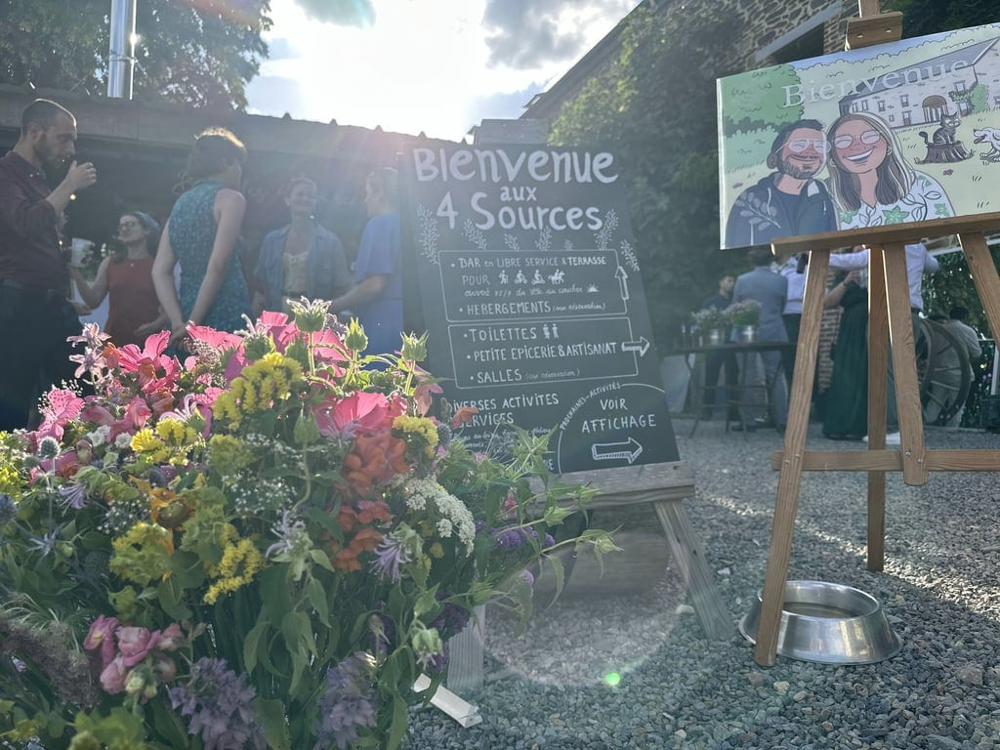
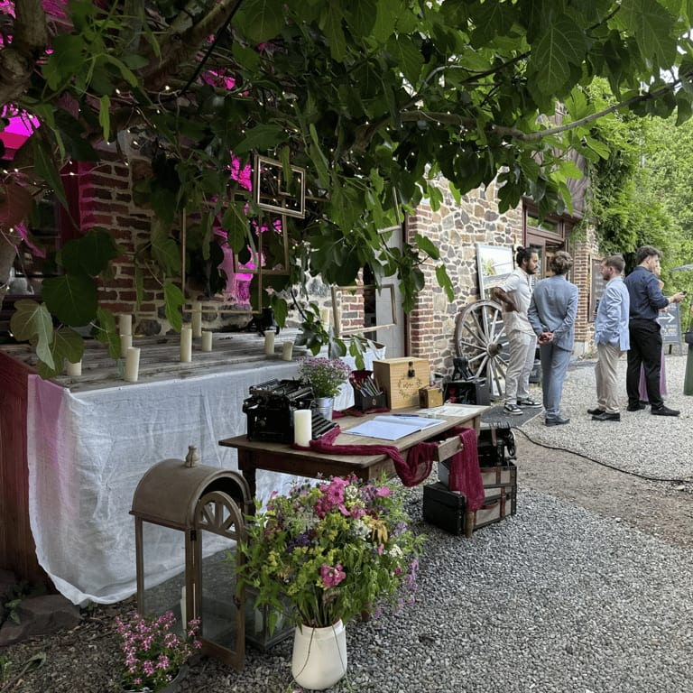
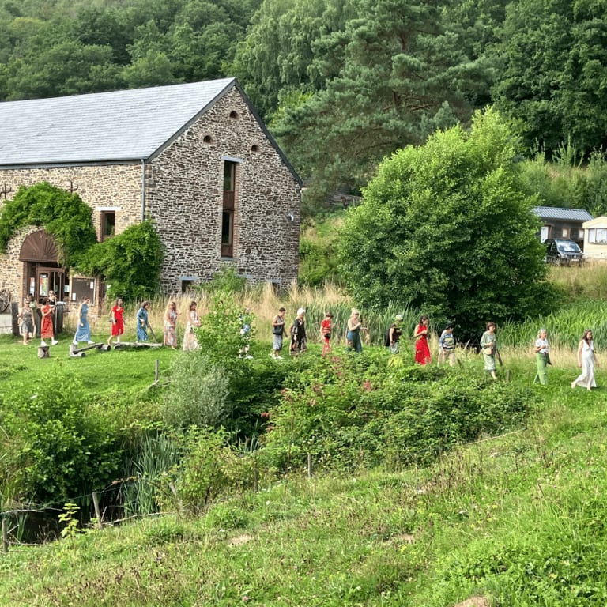
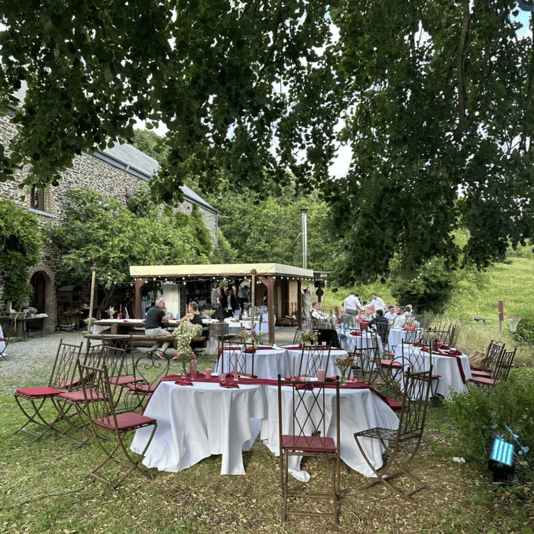
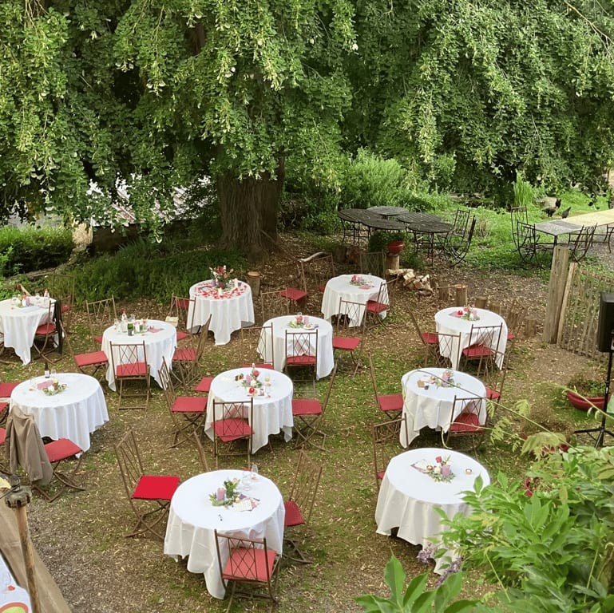
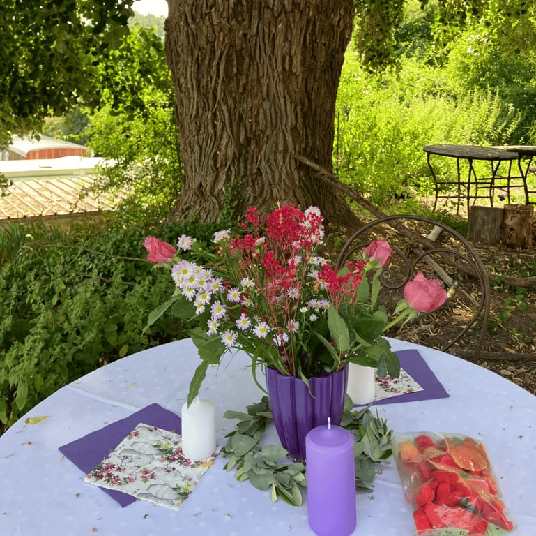
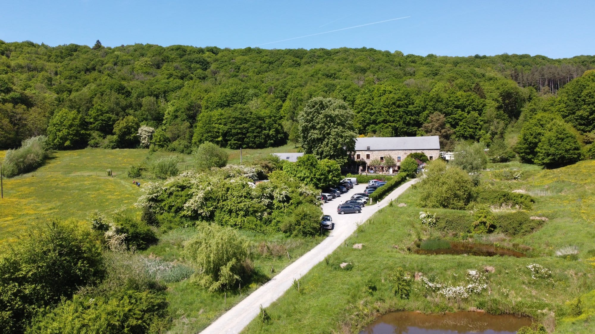
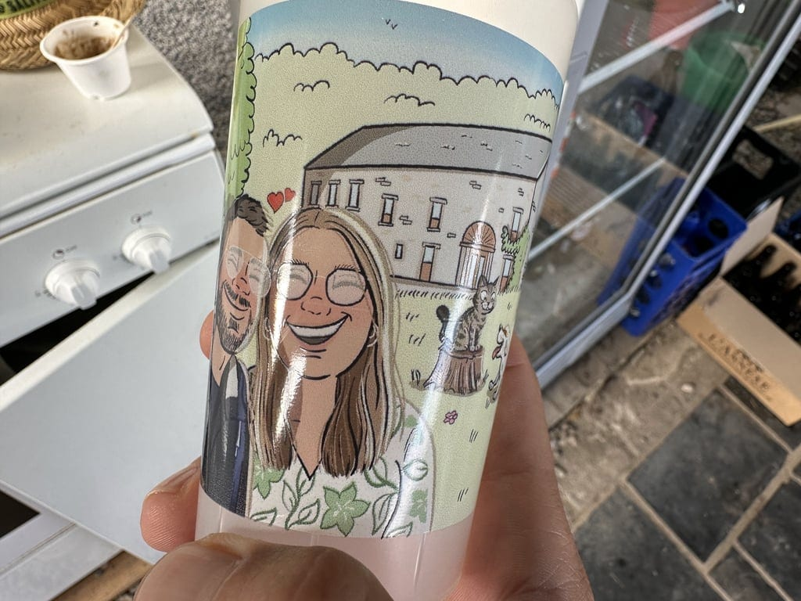
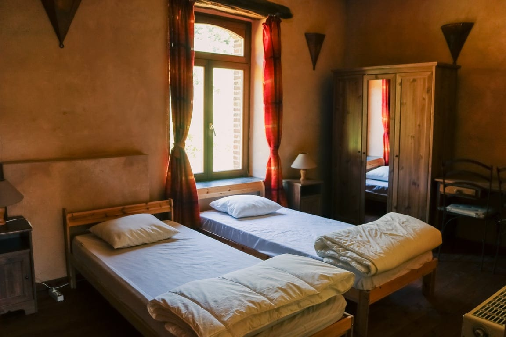

## Vive les marié-es !

### Mariages champêtres et cérémonies forestières 💍

C'est avec une immense joie que nous vous le proposons : venez célébrer votre mariage aux 4 Sources ! Eh oui, il est possible d'organiser la Fête de votre vie (en fait, on vous souhaite des fêtes en permanence) ici, au cœur de la clairière, entouré-es de bois, d'animaux, de vos amis et de votre famille 🐎 Un mariage champêtre, une cérémonie forestière... Tant de possibilités dans la verdure 🍃

<!-- columns -->
<!-- column width="50%" -->

<!-- column width="50%" -->

<!-- /columns -->

### Célébrer en beauté dans nos salles

- Notre grande salle de 145 m² avec bar, sono et vaisselle pour 80 personnes
- Ou notre petite salle cosy pour des ateliers ou repas de groupe (jusqu’à 25 personnes)
- Et la cuisine professionnelle pour préparer les p’tits plats

<!-- columns -->
<!-- column width="50%" -->

<!-- column width="50%" -->

<!-- /columns -->

### Nous mettons à votre disposition :

- Un bar en intérieur et en extérieur
- Le parking

### Dormir sur place pour prolonger la fête

Il est aussi possible de louer le gîte pour dormir sur place (8, 15 ou 25 personnes), et/ou un espace bivouac pour dormir sous tente, hamac ou en van aménagé.

**Le Grand-Duc pour les plus grands groupes :**

<!-- columns -->
<!-- column width="50%" -->

🪄 *La Chevêche + La Hulotte = Le Grand Duc*

- Accueille jusqu’à **25 personnes**
- Rez-de-chaussée, 1er et 2ème étage
- 7 chambres avec salle de douche
- Mezzanine avec 2 lits d’appoints

→ [Découvre le Grand-Duc](/sejours/hebergements-yvoir/le-grand-duc-gite-25-personnes)

<!-- column width="50%" -->

<!-- /columns -->

Bref, ce n'est pas nous qui nous marions mais nous sommes aussi enthousiastes à l'idée de vous accueillir. Et on sait qu'un mariage, ça se prépare quelques mois à l'avance... Alors il est déjà possible d'obtenir plus d'infos en nous écrivant sur [\[email protected\]](mailto:), ou en nous passant un coup de fil au 0490/46.77.10.

### Des expériences enrichissantes pour tous vos invités

**Composez une fête sur-mesure avec des expériences uniques**

**Catalogue des activités**

**Artisanat**
- [🍴Echanges sur les 4 Sources autour d’un repas](/catalogue/echanges-sur-les-4-sources-autour-dun-repas)
- [🔥Fabrication d’allume-feux](/catalogue/fabrication-dallume-feux)
- [🌾Construction de mini cabanes en terre-paille](/catalogue/construction-de-mini-cabanes-en-terre-paille)
- [🛞Construction d’objets en acier de récup’](/catalogue/cration-de-bijoux-en-matriaux-de-rcup)
- [🪵Création d’objets en palettes](/catalogue/cration-dobjets-en-palettes)
- [💎Création de bijoux en matériaux de récup’](/catalogue/construction-dobjets-en-acier-de-rcup)
- [⚡Initiation à la soudure à l’arc](/catalogue/initiation-la-soudure)
**Production et transformation**
- [🥧Ateliers cuisine (sucré ou salé)](/catalogue/ateliers-cuisine-sucr-ou-sal)
- [🍕Atelier pizza](/catalogue/atelier-pizza)
- [🥖Atelier pain au levain](/catalogue/atelier-fabrication-de-pizza-1)
- [🌸Fabrication de bombes à graines](/catalogue/fabrication-de-bombes-graines)
- [🍺Introduction à la zythologie](/catalogue/zythologie)
- [🧀Camembert Party pour groupes](/catalogue/camembert-party)
- [🍕Pizza Party pour groupes](/catalogue/pizza-ou-camembert-party)
- [🥧Cuisine d’un repas ou d’un goûter aux plantes sauvages](/catalogue/cuisine-dun-repas-ou-dun-goter-aux-plantes-sauvages)
- [💎Création de bijoux en matériaux de récup’](/catalogue/construction-dobjets-en-acier-de-rcup)
**Nature et environnement**
- [🦙Visite de la micro-ferme](/catalogue/visite-de-la-micro-ferme)
- [🌾Construction de mini cabanes en terre-paille](/catalogue/construction-de-mini-cabanes-en-terre-paille)
- [💫Initiation à l’astronomie et observation des étoiles](/catalogue/initiation-astronomie-etoiles-yvoir)
- [🪢Grimpe encadrée dans les arbres](/catalogue/grimpe-encadree-dans-les-arbres)
- [🍄Initiation ou perfectionnement à l’identification de champignons](/catalogue/initiation-champignons-yvoir)
**Vie collective**
- [🌾Construction de mini cabanes en terre-paille](/catalogue/construction-de-mini-cabanes-en-terre-paille)
- [🍃Un tour à la découverte du projet des 4 Sources](/catalogue/decouverte-du-projet-des-4-sources)
**Bien-être**
- [🤾🏻‍♂️Initiation au Disc-golf](/catalogue/initiation-au-disc-golf)
- [🐎Bain d’ânes](/catalogue/temps-avec-le-troupeau-d-anes)

> 🎂 **Prêt·e à célébrer un mariage inoubliable ?** Contacte Malau pour imaginer ensemble la fête qui vous ressemble, à **[sejours@les4sources.be](mailto:sejours@les4sources.be)** ou au **+32 (0)490 46 77 10**, ou complète directement [notre formulaire de demande de réservation](https://formulaires.les4sources.be/sejour).
