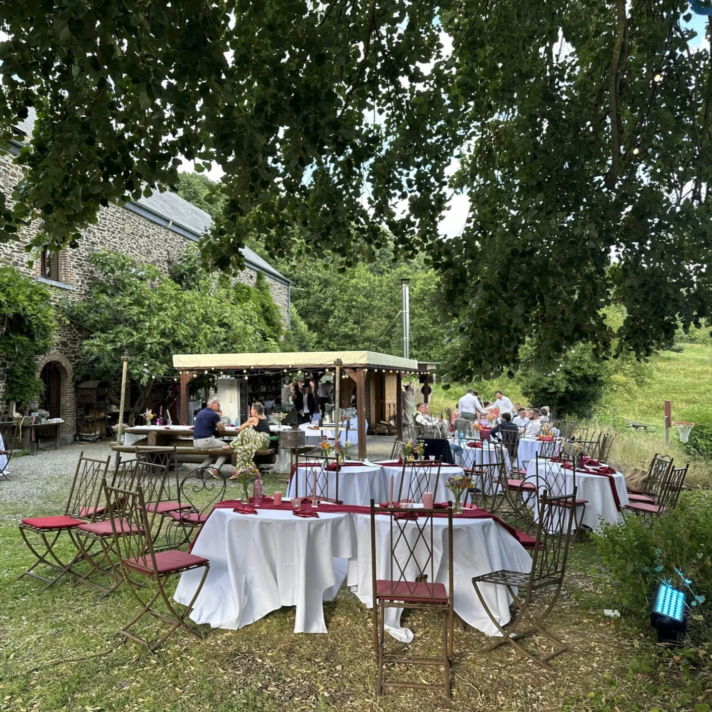
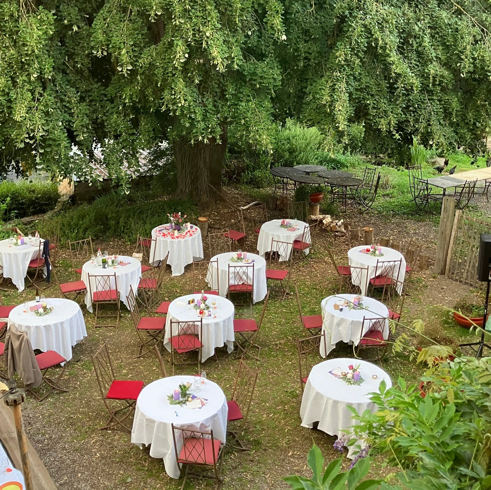
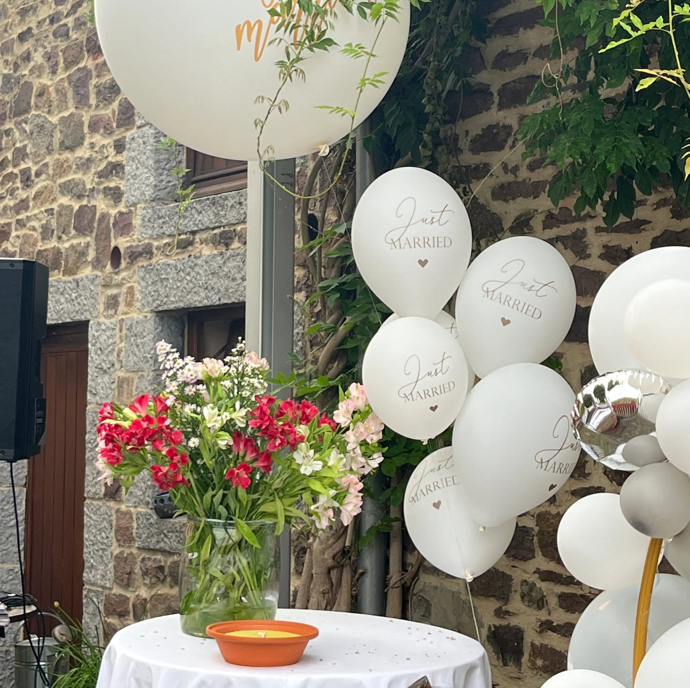

## Vive les marié·es ! 💍

C'est avec une immense joie que nous vous le proposons : venez célébrer votre mariage aux 4 Sources ! Eh oui, il est possible d'organiser la Fête de votre vie (en fait, on vous souhaite des fêtes en permanence) ici, au cœur de la clairière, entouré·es de bois, d'animaux, de vos amis et de votre famille 🐎 Un mariage champêtre, une cérémonie forestière… Tant de possibilités dans la verdure 🍃

<!-- columns -->
<!-- column width="50%" -->

<!-- column width="50%" -->

<!-- /columns -->

## Célébrer en beauté dans nos salles 🎉

- Notre grande salle de 145 m² avec bar, sono et vaisselle pour 80 personnes
- Ou notre petite salle cosy pour des ateliers ou repas de groupe (jusqu’à 25 personnes)
- Et la cuisine professionnelle pour préparer les p’tits plats
- Un bar en intérieur et en extérieur, et le parking

→ [Nos salles et la cuisine](/sejours/salles)

<!-- columns -->
<!-- column width="50%" -->

<!-- column width="50%" -->

<!-- /columns -->

## Dormir sur place pour prolonger la fête 🌙

Il est aussi possible de louer le gîte pour dormir sur place (8, 15 ou 25 personnes), et/ou un espace bivouac pour dormir sous tente, hamac ou en van aménagé.

→ [Découvre nos hébergements](/sejours/hebergements-yvoir)

<!-- columns -->
<!-- column width="50%" -->

<!-- column width="50%" -->

<!-- /columns -->

## Des expériences enrichissantes pour tous vos invités 🎒

Composez une fête sur-mesure avec des expériences uniques : ateliers d’artisanat ou de cuisine, découverte de la nature et du projet, disc-golf, bain d’ânes…

<a class="button" href="/catalogue">Le catalogue des activités</a>

Bref, ce n'est pas nous qui nous marions mais nous sommes aussi enthousiastes à l'idée de vous accueillir. Et on sait qu'un mariage, ça se prépare quelques mois à l'avance…

> 🎂 **Prêt·e à célébrer un mariage inoubliable ?** Contacte Malau pour imaginer ensemble la fête qui vous ressemble, à **[sejours@les4sources.be](mailto:sejours@les4sources.be)** ou au **+32 (0)490 46 77 10**.
