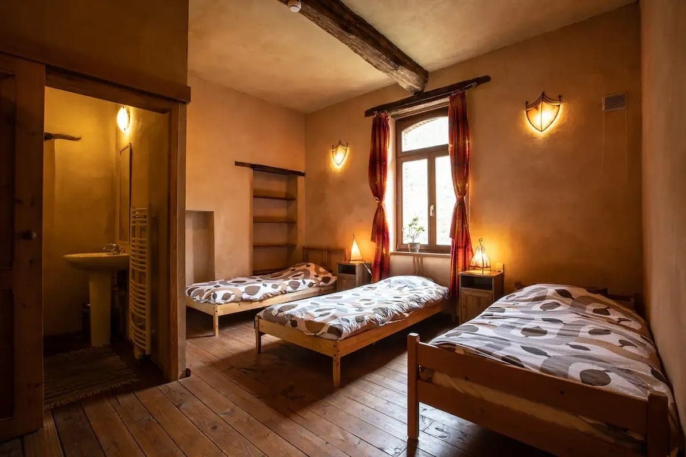
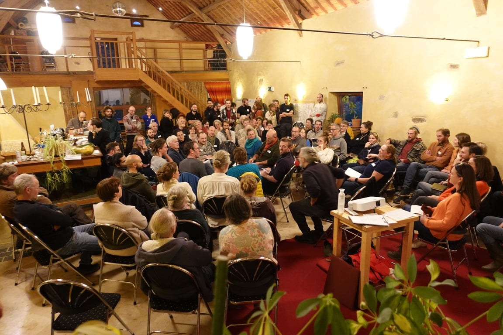
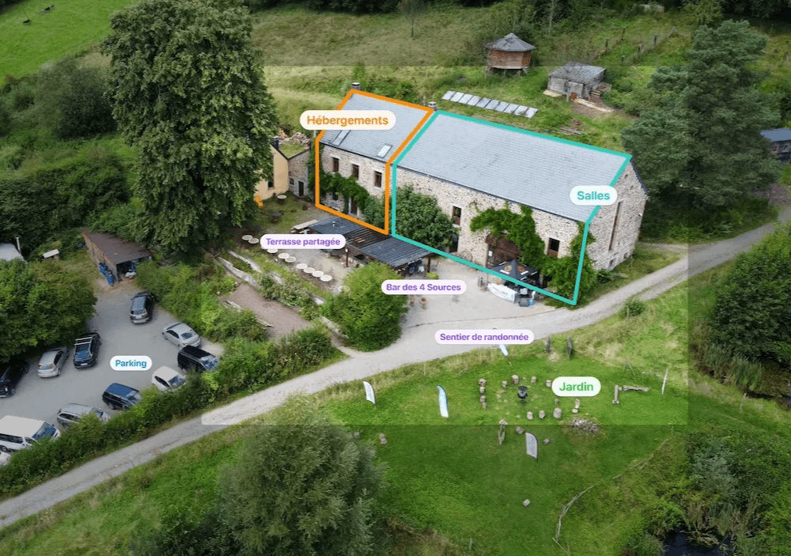
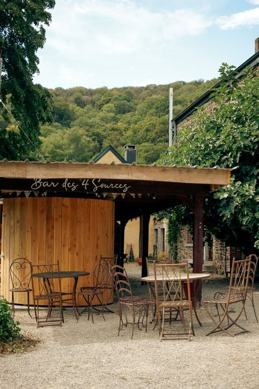
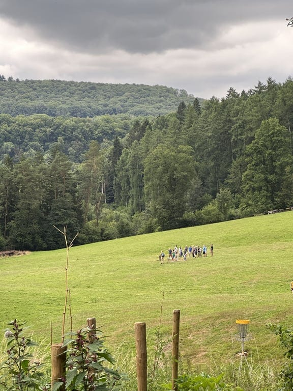
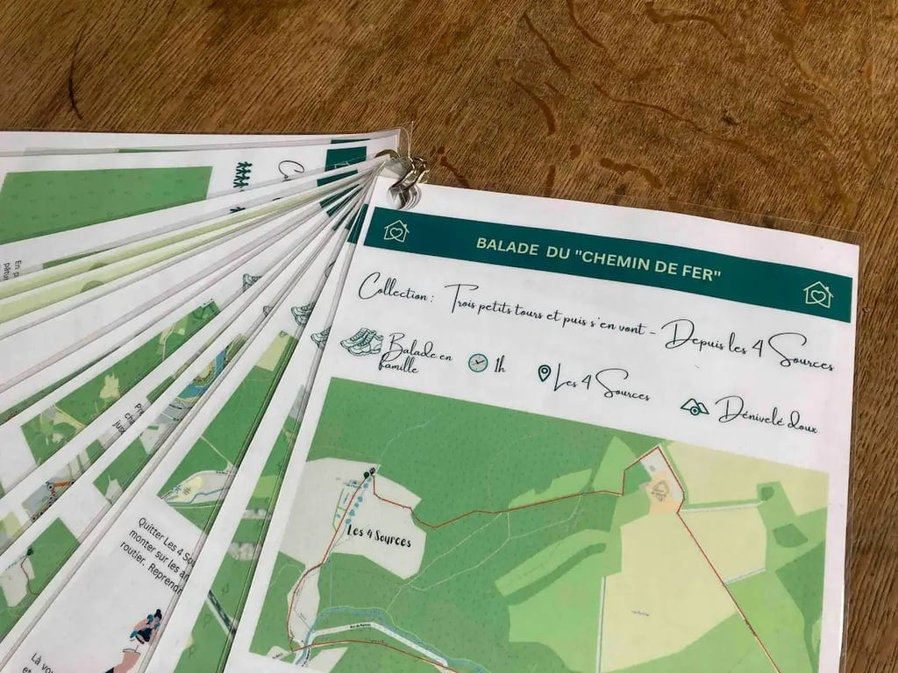

<!-- columns -->
<!-- column width="50%" -->

## [Nos hébergements](/sejours/hebergements-yvoir)

**2 hébergements** pour venir en famille, entre collègues ou entre ami.es jusqu’à 25 personnes. En semaine, des **chambres et lits** accessibles dès 35€ par personne (et même 15€ par enfant).

🏕️ À la belle saison, un **espace pour camper** seul·e ou en groupe de 20 personnes et des espaces pour poser un hamac.

<!-- column width="50%" -->

## [Nos salles et la cuisine](/sejours/salles)

**Des espaces polyvalents pour 10 à 100 personnes**, pour vos conférences, ateliers et autres événements enrichissants.

Notamment **notre petite salle**, idéale pour une journée de mise au vert, une formation, une réunion, un conseil d’administration ou un atelier en cercle.
<!-- /columns -->

<a class="button" href="/sejours/tarifs">Tarifs des hébergements et salles</a>

<a class="button" href="/sejours/disponibilites">Disponibilités</a>

<a class="button" href="/sejours/sejours">Faire une demande de séjour</a>

> 🗞️ Pour être informé·e des prochains événements aux 4 Sources, [inscris-toi à notre newsletter mensuelle](/newsletter).

## Le Bar des 4 Sources

<!-- columns -->
<!-- column width="50%" -->

<!-- column width="50%" -->

Notre magnifique terrasse plein sud et son tilleul centenaire, entourée de 360° de pleine nature, dispose d’un [bar champêtre](/le-bar-des-4-sources) ouvert du lever au coucher du soleil.

La terrasse **est un espace partagé par toutes les personnes de passage sur le lieu** (personnes hébergées, locataires de salles, participant.es à des activités, promeneur.euses).

Elle est accessible à pied, à cheval ou à vélo.

**[Le bar des 4 Sources](/le-bar-des-4-sources)**
<!-- /columns -->

## Le bois des 4 Sources

Avec ta location, tu peux demander l’accès à notre petit bois privé de 1,5 hectare. Accessible par le sentier qui traverse nos prairies, il se trouve à 5 minutes à pied de votre logement. De quoi faire un feu de camp, réaliser des cabanes avec vos enfants, passer du temps en nature et vous ressourcer.

Envoie un e-mail à [sejours@les4sources.be](mailto:sejours@les4sources.be) ou demande le jour même à la personne qui vous accueille s’il est accessible ou s’il y a déjà une activité qui s’y passe durant ton séjour.

## Les balades des 4 Sources

<!-- columns -->
<!-- column width="50%" -->

<!-- column width="50%" -->

Tu trouveras dans chaque gite **un carnet de randonnées** pour explorer la région, que tu sois plus *« petite balade digestive »* entre deux activités ou *« challenge grande rando »*.

Adeptes de la marche, il est aussi possible de [rejoindre Les 4 sources à pied](/a-propos/acces-ahinvaux) depuis la gare d’Yvoir ou de Godinne.
<!-- /columns -->

## Nos autres services

- **Besoin de délicieux repas ?** Demande-nous notre listing de traiteurs partageant la philosophie des 4 Sources.
- **Envie d’un petit déjeuner ?** Nous serons ravis de vous proposer de bons produits bio ou locaux.
- Sur demande, profite du four au feu de bois le vendredi soir, après la cuisson des pains, et **[organise ta Pizza/Camembert Party](/catalogue/pizza-ou-camembert-party)** **🍕**
- Un grand **barbecue** est à la disposition des locataires des espaces (hébergements et salles) sur la terrasse. Le matériel est disponible, mais il faut prévoir du charbon.

> 💡 Pour en savoir plus, pour poser une question au sujet de nos activités, pour demander le tarif pour ton groupe, une seule destination : **[sejours@les4sources.be](mailto:sejours@les4sources.be)** **📬**

## Alors, envie de venir aux 4 Sources ?

**👉** [Complète notre formulaire](https://formulaires.les4sources.be/sejour) pour nous envoyer une demande de réservation.

Le formulaire, très complet, te permet de préciser tes besoins :

✔️ Hébergements ✔️ Salles et/ou cuisine professionnelle ✔️ Espace bivouac et/ou van aménagé ✔️ Activités ✔️ Repas préparés, boulangerie et pizza/camembert parties

> 💁 **Une question au sujet des séjours ?** Contacte Malau à [sejours@les4sources.be](mailto:sejours@les4sources.be) ou au +32 (0)490 46 77 10.

👉 [Conditions générales des séjours aux 4 Sources](/sejours/conditions#block-1420d149331780c1a5abc508422bf971)

[Nos hébergements](/sejours/hebergements-yvoir)

[Nos salles et la cuisine](/sejours/salles)

[Notre espace pour camper](/sejours/bivouac)

[Tarifs des hébergements et salles](/sejours/tarifs)

[Disponibilités](/sejours/disponibilites)

[Un séjour aux 4 Sources](/sejours/sejours)

[Règles du lieu](/sejours/regles-du-lieu)

[Conditions générales des séjours aux 4 Sources](/sejours/conditions)
