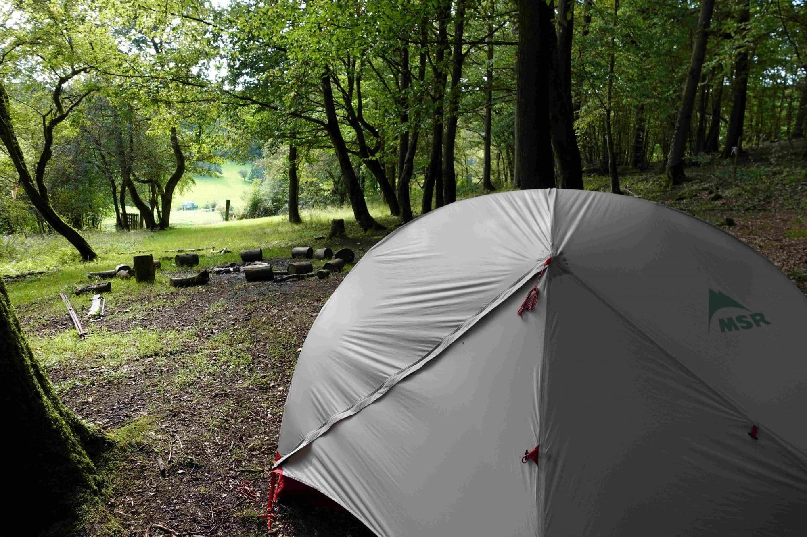

## Avec ta tente ou hamac ⛺

- **Un espace pour ta tente ou hamac** dans le bois des 4 Sources, ou dans nos pâtures pour de plus grands groupes
- Des **sanitaires** dans le bâtiment (WC, évier et douche)
- Une **cuisinière** sur la terrasse, partagée avec les locataires des hébergements et salles

## Loue un hamac 🌙

Voyage léger en louant hamac, tarp et matelas isolant.

## Tarifs 💶

<!-- columns -->
<!-- column width="50%" -->

**En tente ou en hamac**

✔️ Accès aux sanitaires

✔️ Cuisine extérieure

- 7,5 €/nuit/personne
- Location hamac/tarp/matelas isolant : 10 €

<!-- column width="50%" -->

**En van aménagé / camping-car**

✔️ Avec raccord électrique

- 15 €/nuit
<!-- /columns -->

