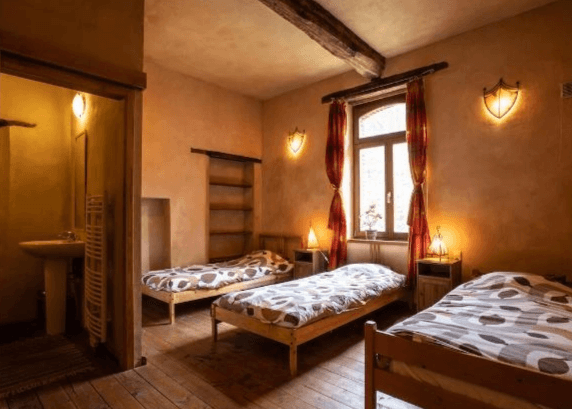
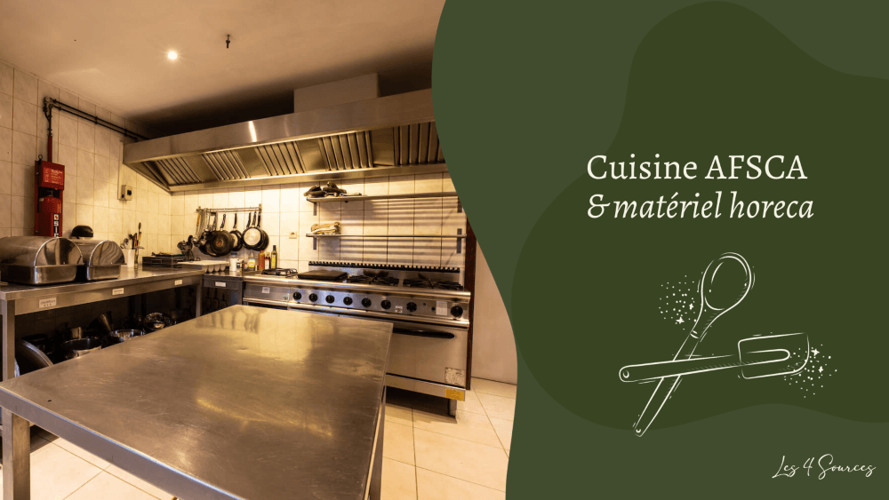

## Des hébergements accueillants

<!-- columns -->
<!-- column width="50%" -->

### La Hulotte

- Accueille jusqu’à **15 personnes**
- Aux 1er et 2ème étages
- 4 chambres, chacune avec salle de douche
- Une mezzanine avec 2 lits d’appoint
- Cuisine et séjour

<!-- column width="50%" -->

### Le Grand-Duc

🪄 *La Chevêche + La Hulotte = Le Grand Duc*

- Accueille jusqu’à **25 personnes**
- Rez-de-chaussée, 1er et 2ème étage
- 7 chambres avec salle de douche
- Mezzanine avec 2 lits d’appoints
<!-- /columns -->

## Des salles pour les grands groupes

Nos salles vous permettent, par exemple, d’organiser une fête et de permettre à 25 personnes de loger sur place. La grande salle accueille jusqu’à 80 personnes et est reliée à la cuisine professionnelle par un passe-plat.

**[En savoir plus sur nos salles](/sejours/salles)**

## La cuisine professionnelle

Les cuisines des gites n’étant pas très grandes, la cuisine professionnelle est un atout très utile pour les grands groupes, pour préparer à manger à plusieurs ou accueillir l’intendance.

**[En savoir plus sur la cuisine professionnelle](/sejours/salles#block-8f00c4b23d06414bacb9c63139fdff11)**

## Des ateliers à faire en famille

**Catalogue des activités**

**Artisanat**
- [🔥Fabrication d’allume-feux](/catalogue/fabrication-dallume-feux) — Sur demande
- [🛞Construction d’objets en acier de récup’](/catalogue/cration-de-bijoux-en-matriaux-de-rcup) — Sur demande
- [🪵Création d’objets en palettes](/catalogue/cration-dobjets-en-palettes) — Sur demande
- [💎Création de bijoux en matériaux de récup’](/catalogue/construction-dobjets-en-acier-de-rcup) — Sur demande
- [⚡Initiation à la soudure à l’arc](/catalogue/initiation-la-soudure) — Sur demande
**Production et transformation**
- [🥧Ateliers cuisine (sucré ou salé)](/catalogue/ateliers-cuisine-sucr-ou-sal) — Sur demande
- [🍕Atelier pizza](/catalogue/atelier-pizza) — Sur demande
- [🥖Atelier pain au levain](/catalogue/atelier-fabrication-de-pizza-1) — Sur demande
- [🌸Fabrication de bombes à graines](/catalogue/fabrication-de-bombes-graines) — En saison
- [🧀Camembert Party pour groupes](/catalogue/camembert-party) — Toujours disponible
- [🍕Pizza Party pour groupes](/catalogue/pizza-ou-camembert-party) — Toujours disponible
- [🥧Cuisine d’un repas ou d’un goûter aux plantes sauvages](/catalogue/cuisine-dun-repas-ou-dun-goter-aux-plantes-sauvages) — En saison
- [💎Création de bijoux en matériaux de récup’](/catalogue/construction-dobjets-en-acier-de-rcup) — Sur demande
**Nature et environnement**
- [🦙Visite de la micro-ferme](/catalogue/visite-de-la-micro-ferme) — Sur demande
- [💫Initiation à l’astronomie et observation des étoiles](/catalogue/initiation-astronomie-etoiles-yvoir) — En saison
- [🪢Grimpe encadrée dans les arbres](/catalogue/grimpe-encadree-dans-les-arbres) — Sur demande
- [🍄Initiation ou perfectionnement à l’identification de champignons](/catalogue/initiation-champignons-yvoir) — En saison
**Vie collective**
- [🍃Un tour à la découverte du projet des 4 Sources](/catalogue/decouverte-du-projet-des-4-sources) — Toujours disponible
**Bien-être**
- [🤾🏻‍♂️Initiation au Disc-golf](/catalogue/initiation-au-disc-golf) — Sur demande
- [🐎Bain d’ânes](/catalogue/temps-avec-le-troupeau-d-anes) — Toujours disponible

> 💡 Pour en savoir plus, pour poser une question au sujet de nos activités, pour demander le tarif pour ton groupe, une seule destination : **[sejours@les4sources.be](mailto:sejours@les4sources.be)** **📬**

## Alors, envie de venir aux 4 Sources ?

**👉** [Complète notre formulaire](https://formulaires.les4sources.be/sejour) pour nous envoyer une demande de réservation.

Le formulaire, très complet, te permet de préciser tes besoins :

✔️ Hébergements ✔️ Salles et/ou cuisine professionnelle ✔️ Espace bivouac et/ou van aménagé ✔️ Activités ✔️ Repas préparés, boulangerie et pizza/camembert parties

> 💁 **Une question au sujet des séjours ?** Contacte Malau à [sejours@les4sources.be](mailto:sejours@les4sources.be) ou au +32 (0)490 46 77 10.
