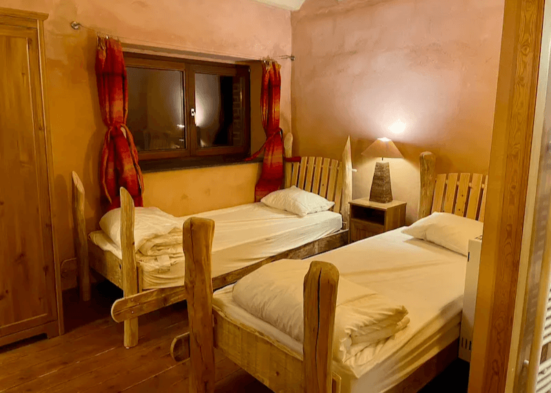
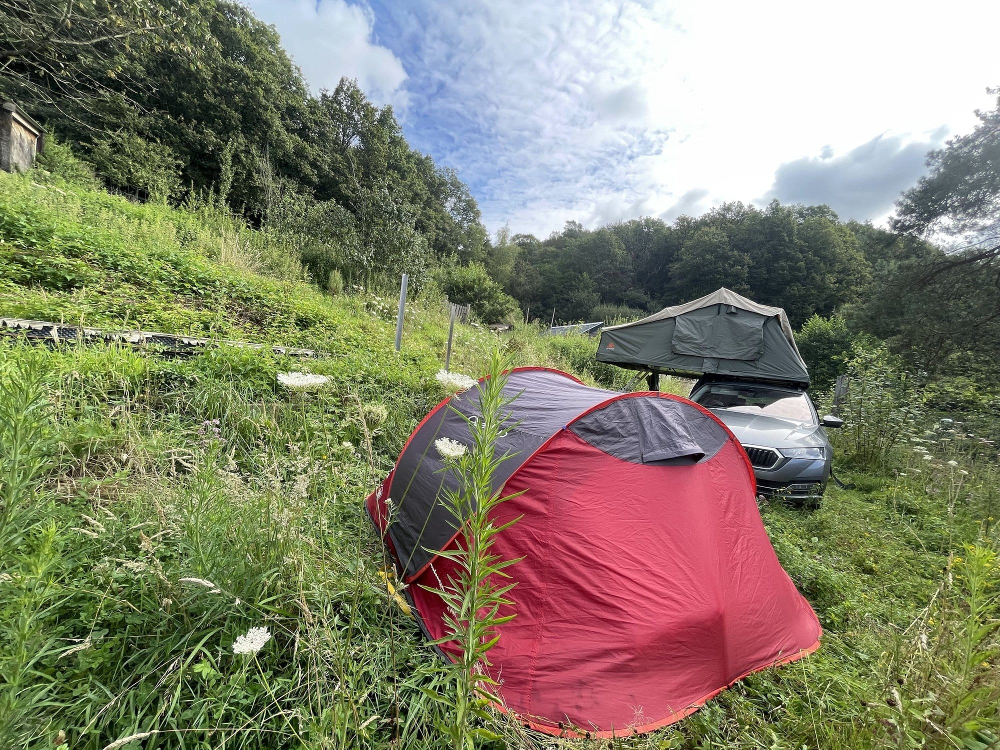

<!-- columns -->
<!-- column width="50%" -->

## [La Chevêche](/sejours/hebergements-yvoir/la-cheveche-gite-8-personnes)

- Accueille jusqu’à **8 personnes**
- Au rez-de-chaussée
- 2 chambres, chacune avec salle de douche
- Cuisine et séjour

<!-- column width="50%" -->

## [La Hulotte](/sejours/hebergements-yvoir/la-hulotte-gite-16-personnes)

- Accueille jusqu’à **15 personnes**
- Aux 1er et 2ème étages
- 4 chambres, chacune avec salle de douche
- Une mezzanine avec 2 lits d’appoint
- Cuisine et séjour
<!-- /columns -->

Chaque gîte est indépendant et a sa propre porte d’entrée. La porte d’accès au bâtiment est commune.

## [Le Grand-Duc](/sejours/hebergements-yvoir/le-grand-duc-gite-25-personnes)

🪄 *La Chevêche + La Hulotte = Le Grand-Duc*

- Accueille jusqu’à **25 personnes**
- Rez-de-chaussée, 1er et 2ème étage
- 7 chambres avec salle de douche
- Mezzanine avec 2 lits d’appoint

→ [Photos des hébergements](/sejours/hebergements-yvoir/photos-des-hbergements)

## [Notre espace pour camper](/sejours/bivouac) ⛺

En pleine forêt ou dans les pâtures en lisière de celle-ci, un espace où **poser sa tente et son hamac**. Idéal pour profiter pleinement de notre ciel étoilé, de la nature et du calme environnant.

**Envie d’une nouvelle expérience en hamac ?** Nous vous en louons (simple… ou double !) pour découvrir cette douce sensation d’être bercé·e·s comme une chenille entre 2 arbres.

## Questions fréquentes 💬

### Puis-je venir avec mon chien ?

Oui c’est possible, avec un maximum de 2 chiens sur le lieu et moyennant un supplément de 50 € par chien et par séjour.

### Puis-je louer la salle pour une fête d’anniversaire ?

Oui, avec grand plaisir, pour autant que vous teniez compte du fait que la salle se trouve sur un lieu habité par plusieurs familles et qu’il y a des règles à respecter concernant le bruit. Si vous préférez un chalet isolé au milieu du néant, c’est ailleurs 🤗 Le mieux étant de nous contacter pour nous faire part de votre demande.

C’est aussi l’occasion d’inviter ses amis et sa famille à participer à [une activité organisée par les 4 Sources](/activites).

*Un mariage aux 4 Sources*
