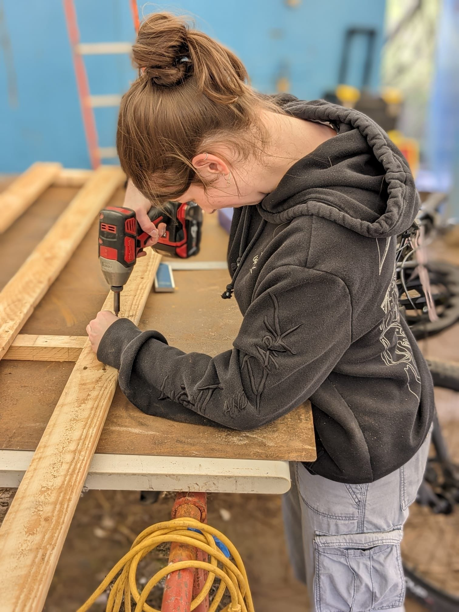
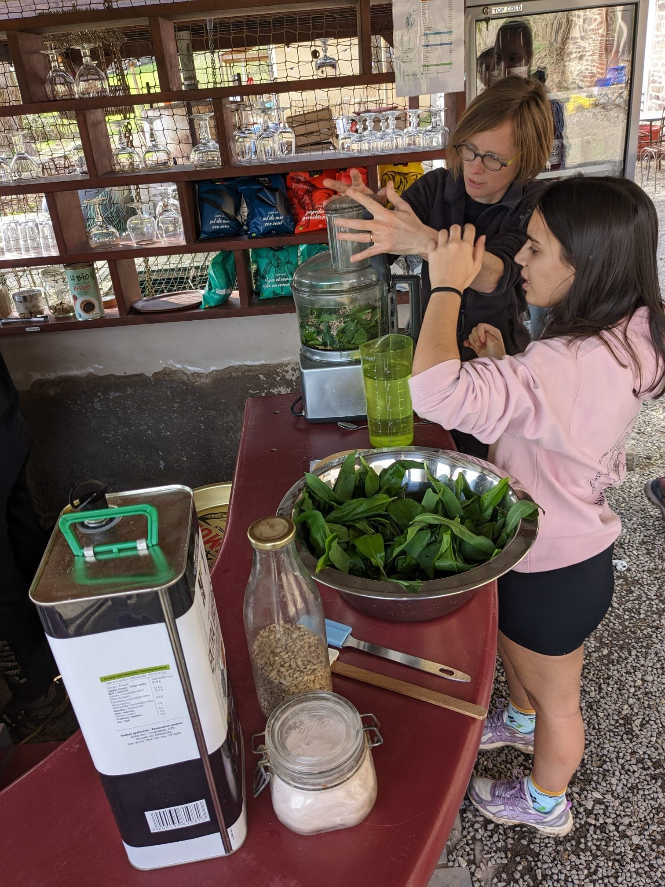
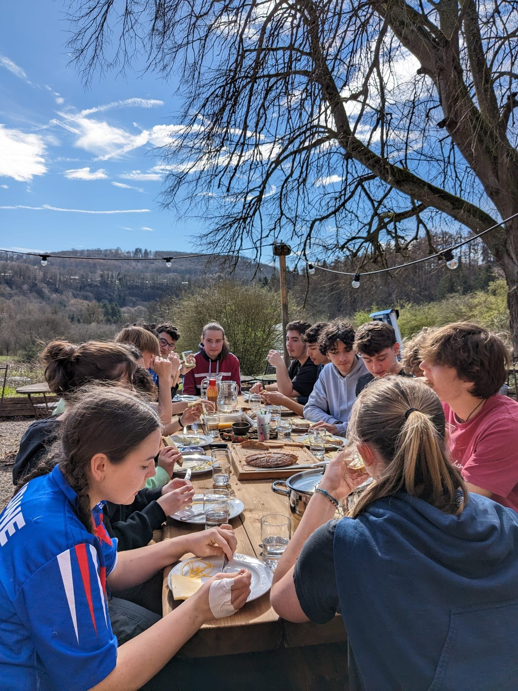
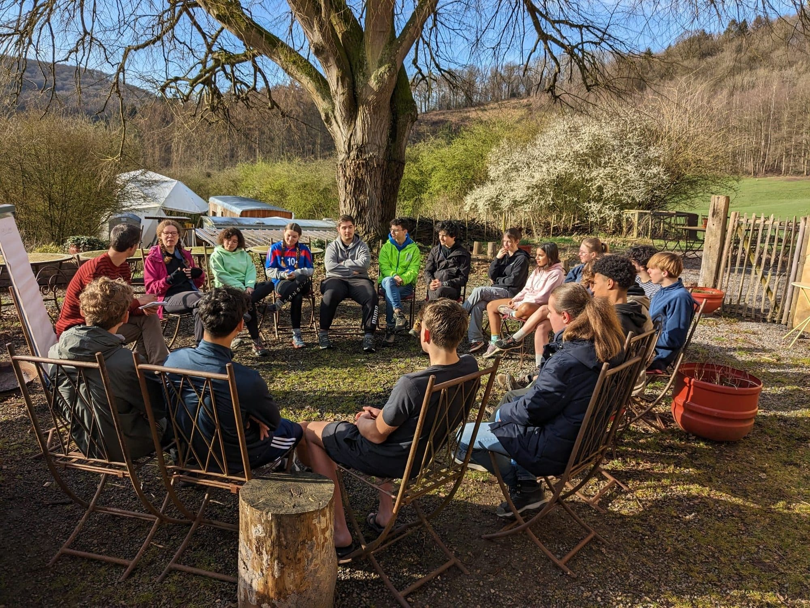
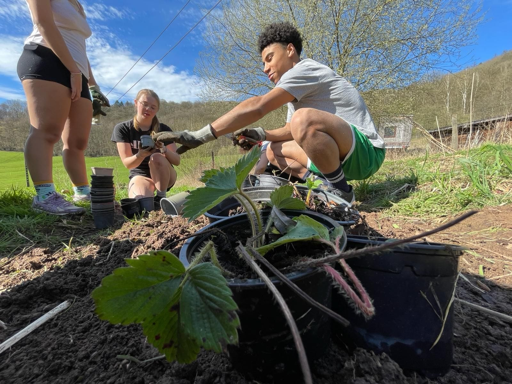

Vous êtes au bon endroit ! Nous proposons des retraites et séjours scolaires incroyables qui offrent une variété d'activités sur les thématiques de l'environnement, de l'artisanat ou de la vie collective. Préparez-vous à vivre plusieurs jours d'exploration, d'apprentissage et surtout de GRAND plaisir !

## Des hébergements qui déchirent grave 🛏️

<!-- columns -->
<!-- column width="50%" -->

🪄 *La Chevêche + La Hulotte = Le Grand-Duc*

- Accueille jusqu’à **25 personnes**
- Rez-de-chaussée, 1er et 2ème étage
- 7 chambres avec salle de douche
- Mezzanine avec 2 lits d’appoint

→ [Découvre le Grand-Duc](/sejours/hebergements-yvoir/le-grand-duc-gite-25-personnes)

<!-- column width="50%" -->

<!-- /columns -->

## Ils l’ont fait ! 📸

<!-- columns -->
<!-- column width="33.3%" -->

<!-- column width="33.3%" -->

<!-- column width="33.3%" -->

<!-- /columns -->

> 😎 *« C’était trop génial, on aurait voulu rester tellement plus longtemps ! »*

<!-- columns -->
<!-- column width="50%" -->

<!-- column width="50%" -->

<!-- /columns -->

## Du fun et des découvertes pour tous ! 🎒

Artisanat (soudure à l’arc, objets en palettes ou en acier de récup’), cuisine et pizza party, découverte de la micro-ferme, des étoiles ou du projet, disc-golf, bain d’ânes… Chaque activité s’organise sur demande ou en saison.

<a class="button" href="/catalogue">Le catalogue des activités</a>
