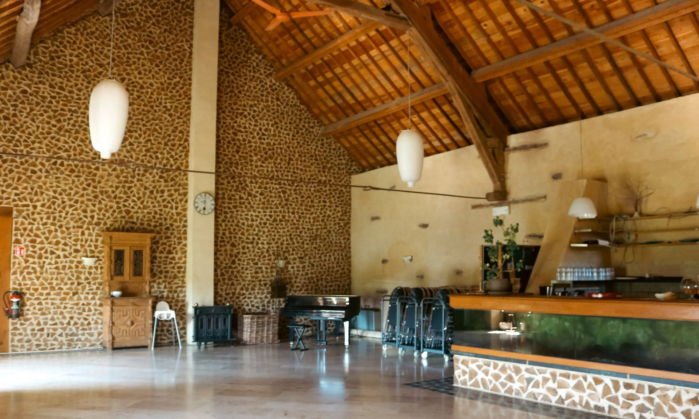
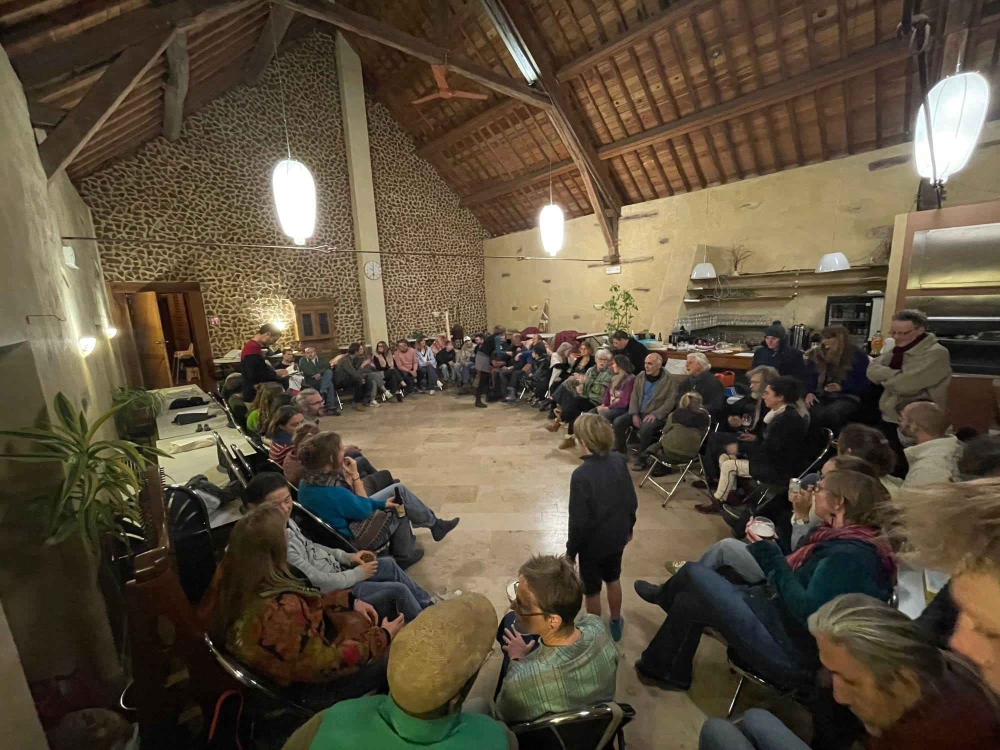
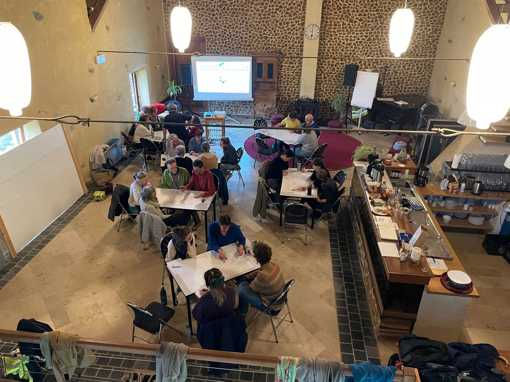
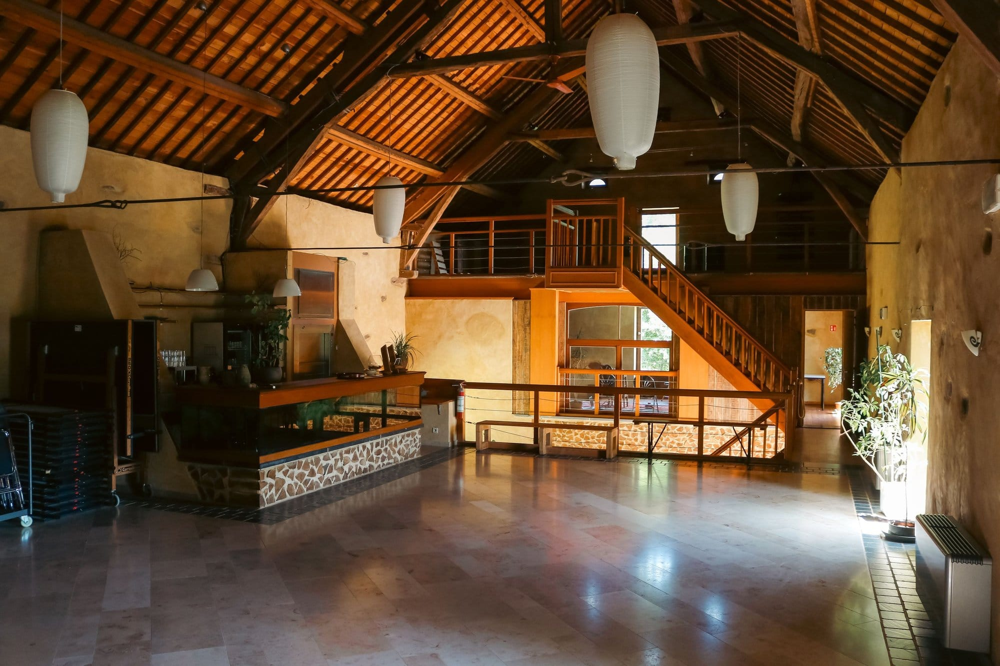
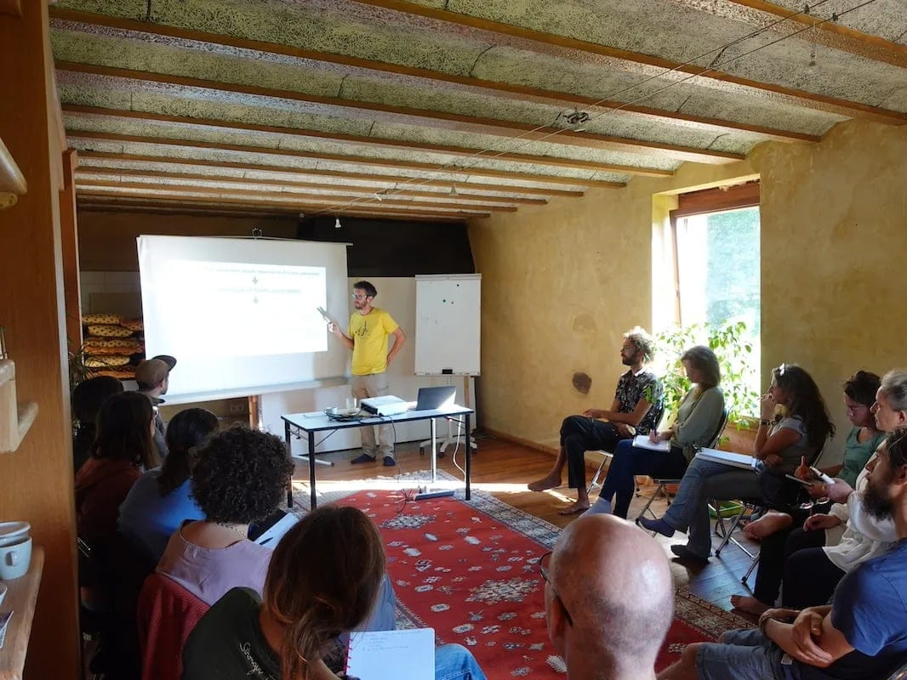
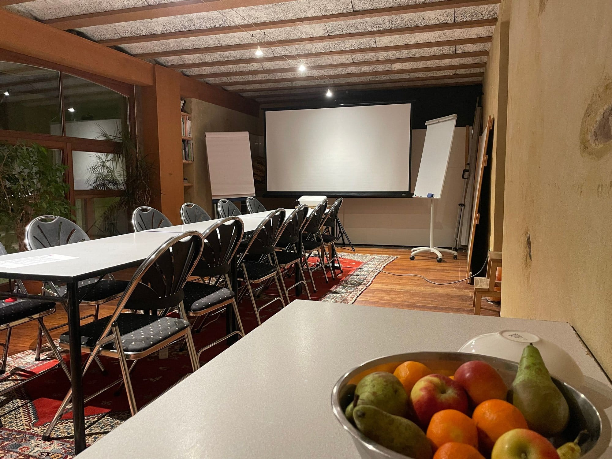
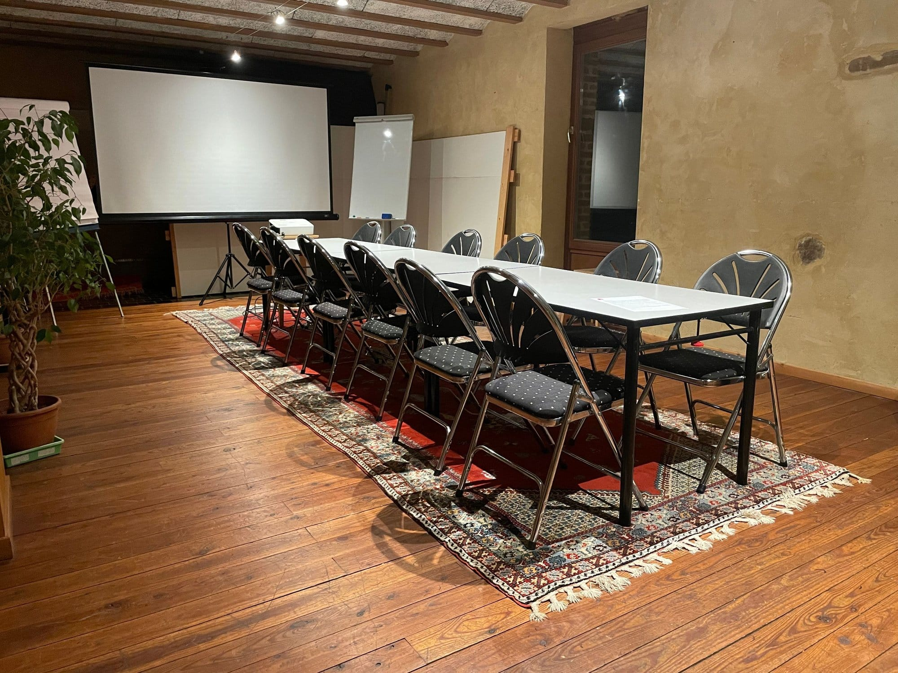

Nos espaces se combinent au choix avec notre cuisine professionnelle et, bien évidemment, avec notre terrasse et le bar extérieur au cadre exceptionnel.

- [La Grande Salle](#la-grande-salle-), de 30 à 100 personnes
- [La Petite Salle](#la-petite-salle-), de 10 à 30 personnes
- [La cuisine professionnelle](#la-cuisine-professionnelle-)

## La Grande Salle 🎉

Une **salle majestueuse** dans l’ancienne ferme d’Ahinvaux, avec un bar derrière lequel on trouve de la vaisselle pour 80 personnes. Idéale pour un séminaire, une conférence, un grand repas de famille ou des ateliers avec différentes tables.

- 145 mètres carrés, sol carrelé
- Pièce ouverte sur le hall d’entrée et l’épicerie des 4 Sources
- De 30 à 100 personnes

### À votre disposition

- Chaises et tables pliantes
- Vaisselle pour 80 personnes
- Bar avec éviers
- Samovar, percolateur, bouilloire et thermos
- Frigo
- Monte-plats entre l’arrière-cuisine et la salle
- Sono avec 2 micros
- WiFi

<!-- columns -->
<!-- column width="50%" -->

*Grand cercle d’amis*

*Un séminaire*

<!-- column width="50%" -->

*Ateliers en intelligence collective*

*Dressée pour une fête*
<!-- /columns -->

## La Petite Salle 🪑

Une sympathique **petite salle** pour les petits groupes, idéale pour les formations, ateliers, conseils d’administration ou mises au vert.

- 45 mètres carrés, plancher en bois
- Pièce fermée avec chauffage
- De 10 à 30 personnes

| Configuration | Capacité |
| --- | --- |
| Pour du yoga | 9 participants + instructeur·rice |
| Pour un cours | 20 participants + formateur·rice |
| Pour un cercle | 30 participants |
| Pour une longue table | 18 personnes |

### À votre disposition

- Tables et chaises pliantes
- Percolateur, bouilloire et thermos
- Flipchart
- Écran de projection et vidéoprojecteur
- WiFi
- En option, sur demande : buffet de produits locaux

<!-- columns -->
<!-- column width="50%" -->

<!-- column width="50%" -->

<!-- /columns -->

## La cuisine professionnelle 🍳

La **cuisine** est idéalement située au rez-de-chaussée du bâtiment, avec un accès direct vers l’extérieur pour le chargement et le déchargement depuis un véhicule. Idéale pour un **atelier cuisine** ou pour la **transformation alimentaire**.

### À votre disposition

- Matériel horeca
- Four au gaz
- Frigo
- Lave-vaisselle professionnel à cycle court
- Monte-plats pour l’envoi des plats vers la grande salle

## Tarifs 💶

Les salles et la cuisine se louent pour 2 heures, une demi-journée, une journée ou plusieurs jours, en semaine comme le week-end.

<a class="button" href="/sejours/tarifs">Tarifs complets pour les salles et hébergements</a>
