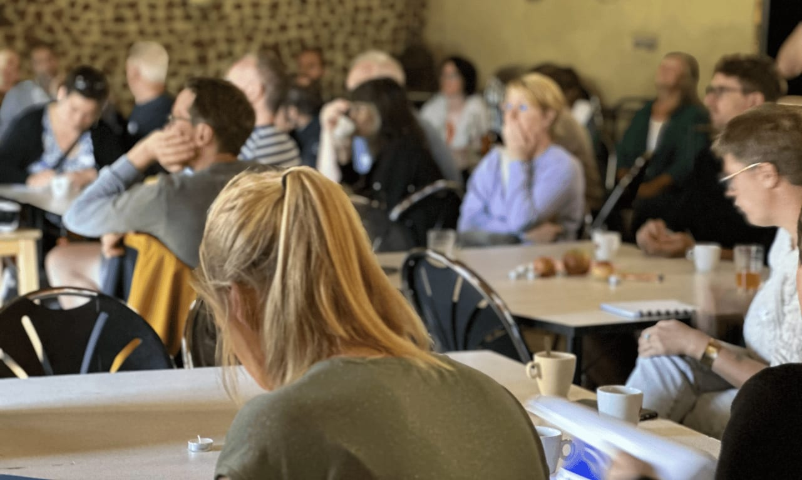
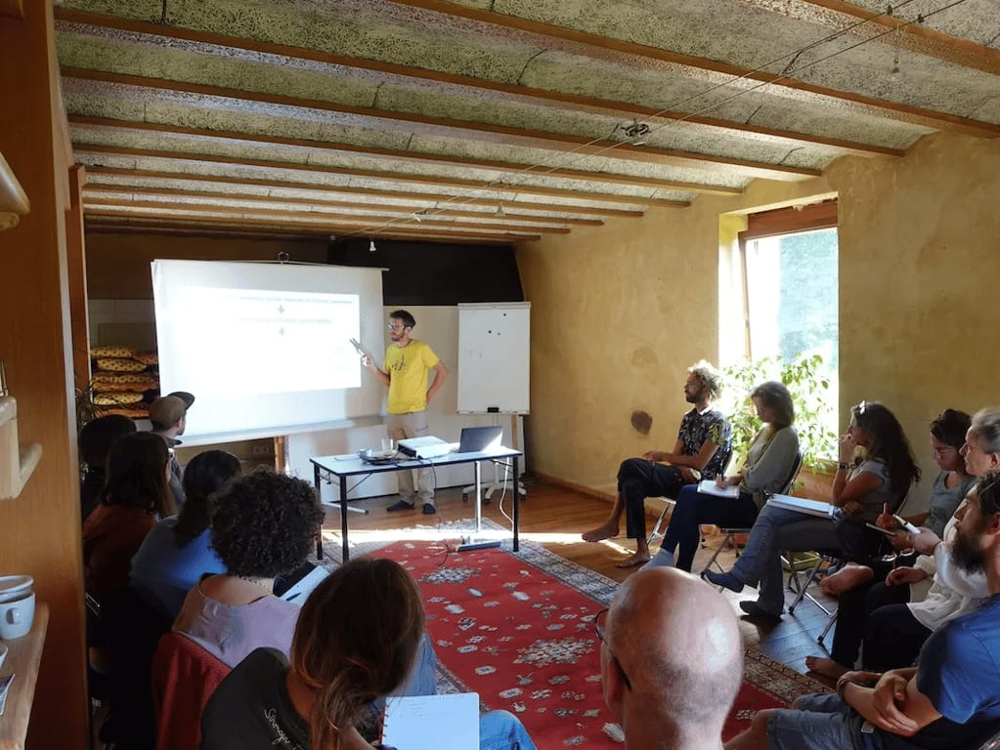
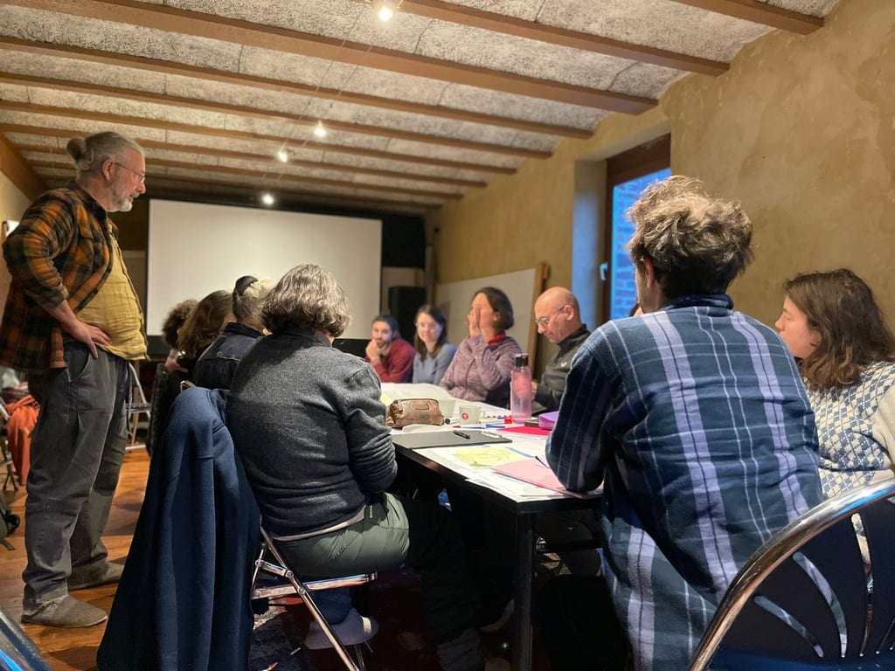
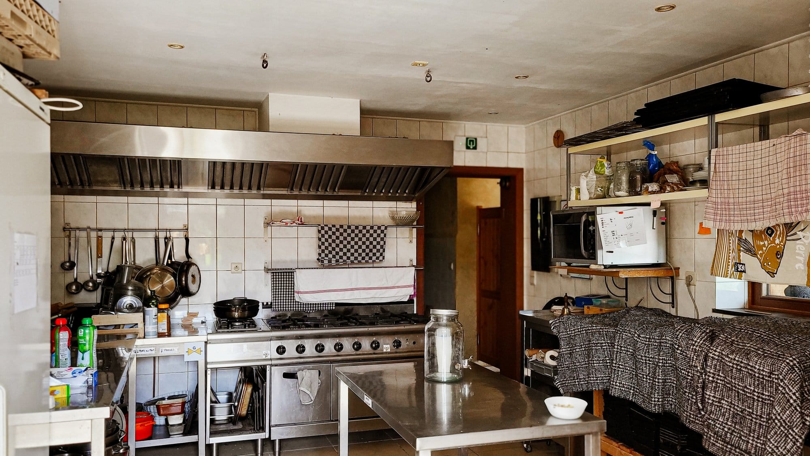

#### **Des espaces polyvalents et modulables pour accueillir vos événements privés et professionnels dans une ancienne grange vibrant à la douce chaleur de matériaux naturels.**

Nos espaces se combinent au choix avec notre cuisine professionnelle et, bien évidemment, avec notre terrasse et le bar extérieur au cadre exceptionnel.

[La Grande Salle](/sejours/salles#block-2395bc0f52524e968fd570349c26262d) [La Petite Salle](/sejours/salles#block-d73e61630c6c4a788bc11ba5b658294f) [La cuisine professionnelle](/sejours/salles#block-8f00c4b23d06414bacb9c63139fdff11)

## La Grande Salle

<!-- columns -->
<!-- column width="50%" -->

*Grand cercle d’amis*

<!-- column width="50%" -->

*Ateliers en intelligence collective*

<!-- /columns -->

<!-- columns -->
<!-- column width="50%" -->

Une **salle majestueuse** dans l’ancienne ferme d’Ahinvaux avec un bar derrière lequel on trouve de la vaisselle pour 80 personnes.

Idéal pour un séminaire, une conférence, un grand repas de famille ou des ateliers avec différentes tables.

- 145 mètres carrés
- Sol carrelé
- Pièce ouverte sur le hall d’entrée et l’épicerie des 4 Sources

<!-- column width="50%" -->

#### À votre disposition

- Chaises et tables pliantes
- Vaisselle pour 80 personnes
- Bar avec éviers
- Samovar, percolateur, bouilloire et thermos
- Frigo
- Monte-plats entre l’arrière-cuisine et la salle
- Sono avec 2 micros
- WiFi
<!-- /columns -->

## La Petite Salle

<!-- columns -->
<!-- column width="50%" -->

<!-- column width="50%" -->

<!-- /columns -->

<!-- columns -->
<!-- column width="50%" -->

Une sympathique **petite salle** pour les petits groupes, idéale pour les formations, ateliers, conseils d’administration ou mises au vert.

- 45 mètres carrés
- Plancher en bois
- Pièce fermée avec chauffage

<!-- column width="50%" -->

#### À votre disposition

- Tables et chaises pliantes
- Percolateur et bouilloire
- Thermos
- Flipchart
- Écran de projection et vidéoprojecteur
- WiFi

#### En option (sur demande)

- Buffet de produits locaux
<!-- /columns -->

| Configuration |  |
| --- | --- |
| Pour du yoga | 9 participants + instructeur·rice |
| Pour un cours | 20 participants + formateur·rice |
| Pour un cercle | 30 participants |
| Pour une longue table | 18 personnes |

## La cuisine professionnelle

<!-- columns -->
<!-- column width="50%" -->

La **cuisine** est idéalement située au rez-de-chaussée du bâtiment, avec un accès direct vers l’extérieur pour le chargement et déchargement depuis un véhicule.

Idéale pour un **atelier cuisine** ou pour la **transformation alimentaire**.

<!-- column width="50%" -->

#### À votre disposition

- Matériel horeca
- Four au gaz
- Frigo
- Lave-vaisselle professionnel à cycle court
- Monte-plats pour l’envoi des plats vers la grande salle
<!-- /columns -->

→ **[Tarifs complets pour les salles et hébergements](/sejours/tarifs)**

> 💡 Pour en savoir plus, pour poser une question au sujet de nos activités, pour demander le tarif pour ton groupe, une seule destination : **[sejours@les4sources.be](mailto:sejours@les4sources.be)** **📬**

## Alors, envie de venir aux 4 Sources ?

**👉** [Complète notre formulaire](https://formulaires.les4sources.be/sejour) pour nous envoyer une demande de réservation.

Le formulaire, très complet, te permet de préciser tes besoins :

✔️ Hébergements ✔️ Salles et/ou cuisine professionnelle ✔️ Espace bivouac et/ou van aménagé ✔️ Activités ✔️ Repas préparés, boulangerie et pizza/camembert parties

> 💁 **Une question au sujet des séjours ?** Contacte Malau à [sejours@les4sources.be](mailto:sejours@les4sources.be) ou au +32 (0)490 46 77 10.
