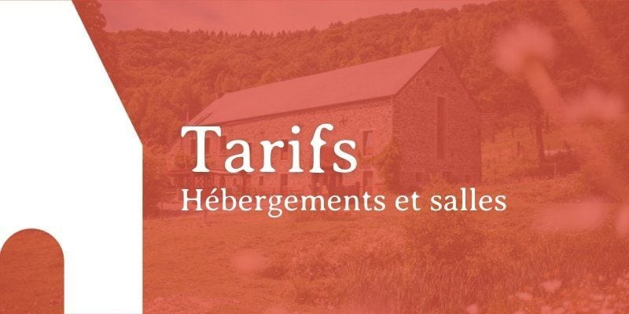
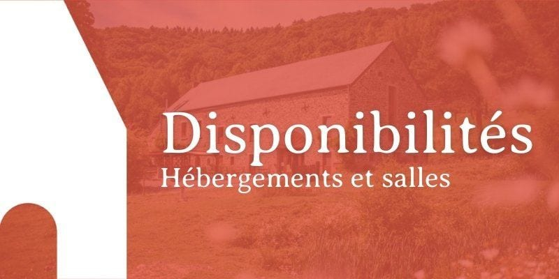
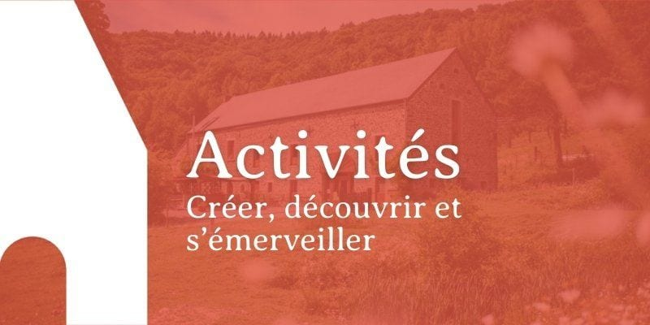
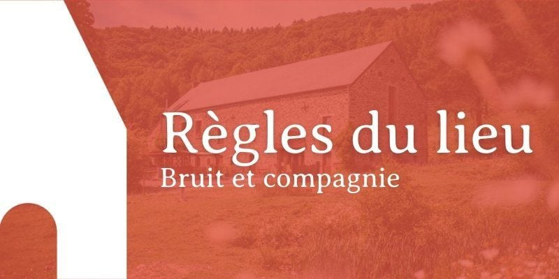
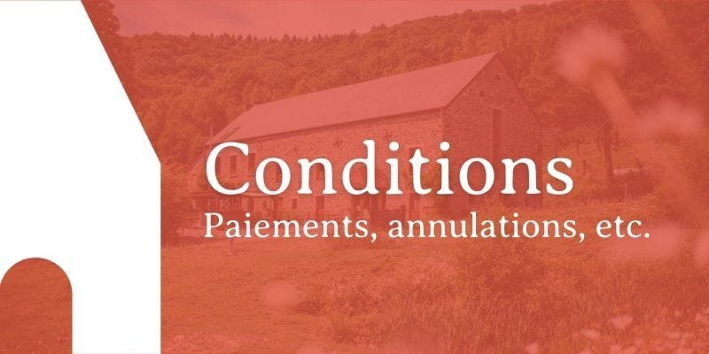

> 💡 Pour en savoir plus, pour poser une question au sujet de nos activités, pour demander le tarif pour ton groupe, une seule destination : **[sejours@les4sources.be](mailto:sejours@les4sources.be)** **📬**

## Alors, envie de venir aux 4 Sources ?

**👉** [Complète notre formulaire](https://formulaires.les4sources.be/sejour) pour nous envoyer une demande de réservation.

Le formulaire, très complet, te permet de préciser tes besoins :

✔️ Hébergements ✔️ Salles et/ou cuisine professionnelle ✔️ Espace bivouac et/ou van aménagé ✔️ Activités ✔️ Repas préparés, boulangerie et pizza/camembert parties

<!-- columns -->
<!-- column width="50%" -->

### [Tarifs](/sejours/tarifs)

Hébergements de groupes, chambres, salles, bivouac et compagnie. Tous nos tarifs s’y retrouvent.

<a class="button" href="/sejours/tarifs">Tarifs des locations</a>

<!-- column width="50%" -->

### [Disponibilités](/sejours/disponibilites)

Actuellement, tu y trouveras les disponibilités des hébergements de groupe. Pour le reste, le mieux est de nous contacter.

<a class="button" href="/sejours/disponibilites">Disponibilités</a>
<!-- /columns -->

<!-- columns -->
<!-- column width="50%" -->

### [Activités](/activites)

Il y a tant à faire aux 4 Sources ! Y venir pour un séjour, c’est l’occasion d’expérimenter de nombreuses activités étonnantes.

<a class="button" href="/activites">Catalogue d'activités</a>

<!-- column width="50%" -->

### [Règles du lieu](/sejours/regles-du-lieu)

Les 4 Sources sont un lieu de vie traversés par un sentier public. Voici les règles à suivre, notamment en matière de bruit.

<a class="button" href="/sejours/regles-du-lieu">Règles du lieu</a>
<!-- /columns -->

<!-- columns -->
<!-- column width="50%" -->

### [Conditions générales](/sejours/conditions)

Nos conditions sont plutôt sympas, et il est toujours intéressant d’y passer pour une lecture en diagonale avant de réserver.

<a class="button" href="/sejours/conditions">Conditions générales</a>
<!-- /columns -->
