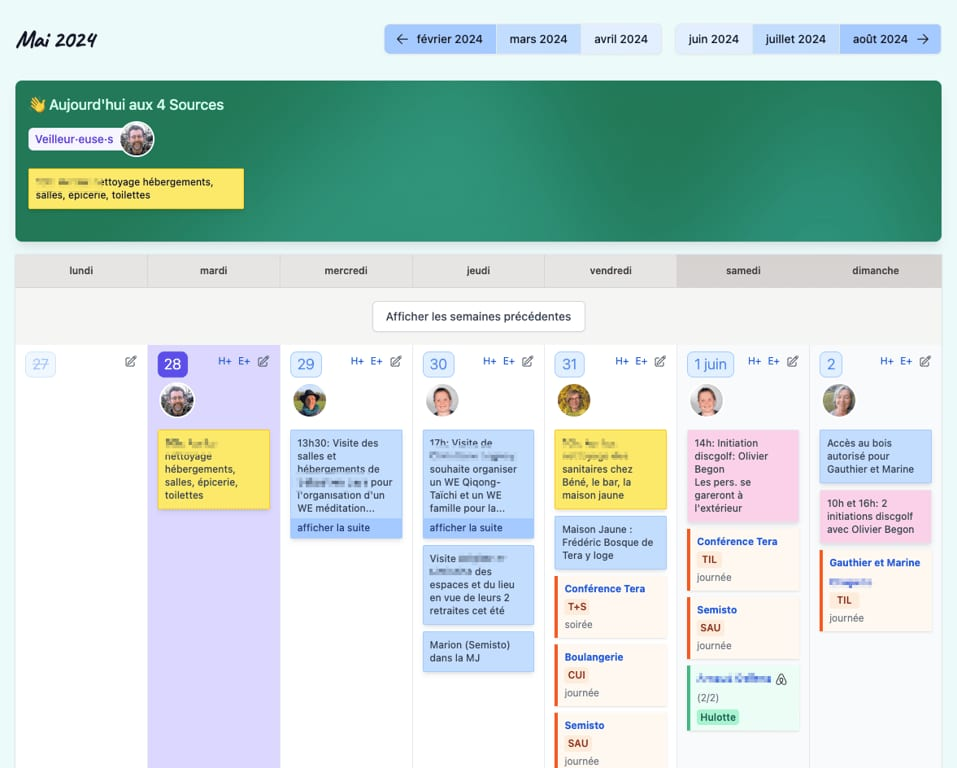
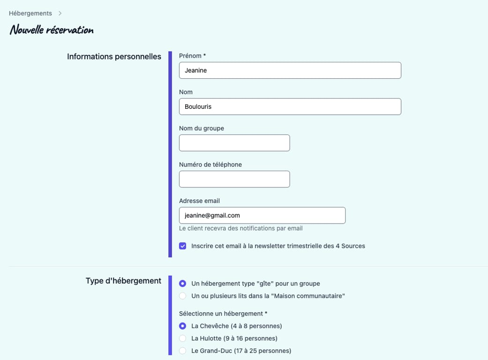
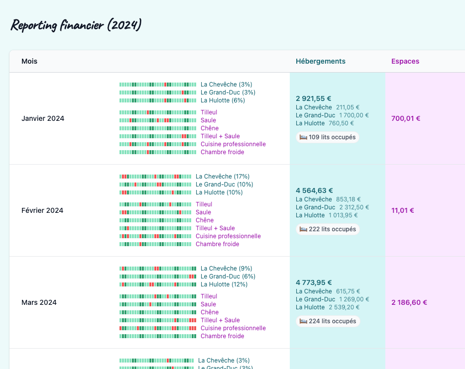

#### **Claudy est le 5ème mousquetaire des 4 Sources. C’est le petit nom de notre logiciel de gestion open source, programmé par** **[Michael](/collectif/michael-hulet)** **et d’autres contributeurs.**

## Agenda

## Gestion des réservations

## Reporting

Claudy est un logiciel open source en Ruby on Rails.

Son code est intégralement accessible [sur GitHub](https://github.com/les4sources/claudy).
