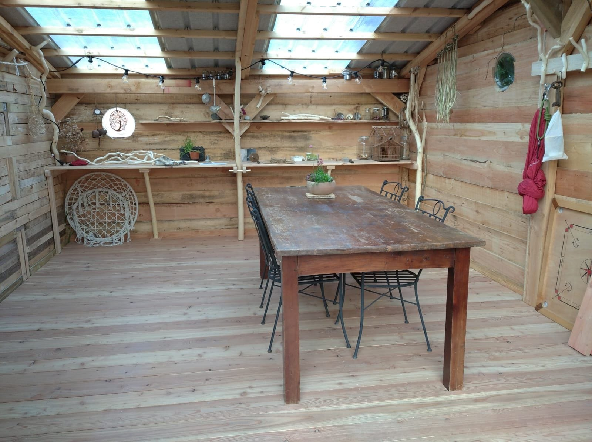
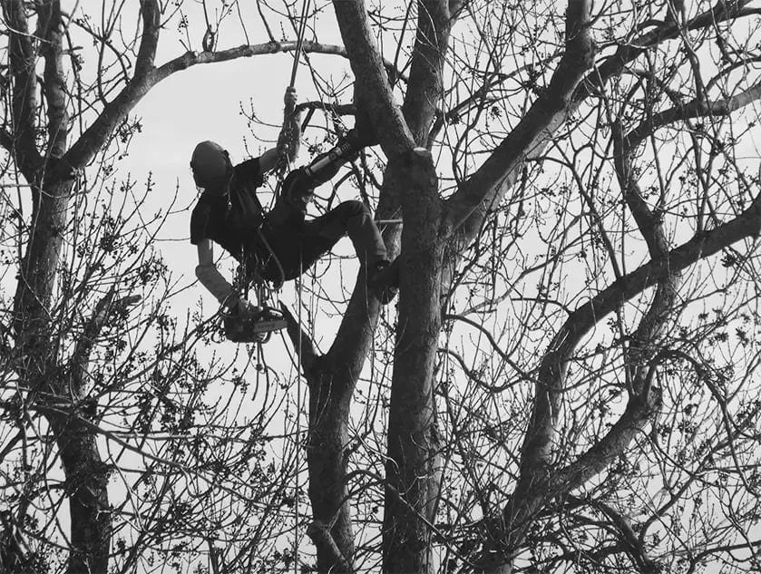

**Artisan-designer et passionné des arbres,** **[Olivier](/collectif/olivier-vanhamme)** **met ses compétences au service d’une société en changement.**

<!-- columns -->
<!-- column width="50%" -->

## Designer

Olivier vous accompagne dans la réalisation d’objets et espaces uniques, utiles et esthétiques qui ont du sens. Soit via des [ateliers](https://debranchesenplanches.be/propositions/#ateliers), soit via des [réalisations sur mesure](https://debranchesenplanches.be/propositions/#surmesure).

<!-- column width="50%" -->

## Arboriste

Olivier vous propose ses services pour de [l’élagage ou de l’abattage](https://debranchesenplanches.be/propositions/#elagage).
<!-- /columns -->

<a class="bookmark" href="https://debranchesenplanches.be/">Accueil</a>

[Accueil](https://debranchesenplanches.be/) — Comment prendre sa place dans une volonté de respect de l’Homme et de la Nature?
