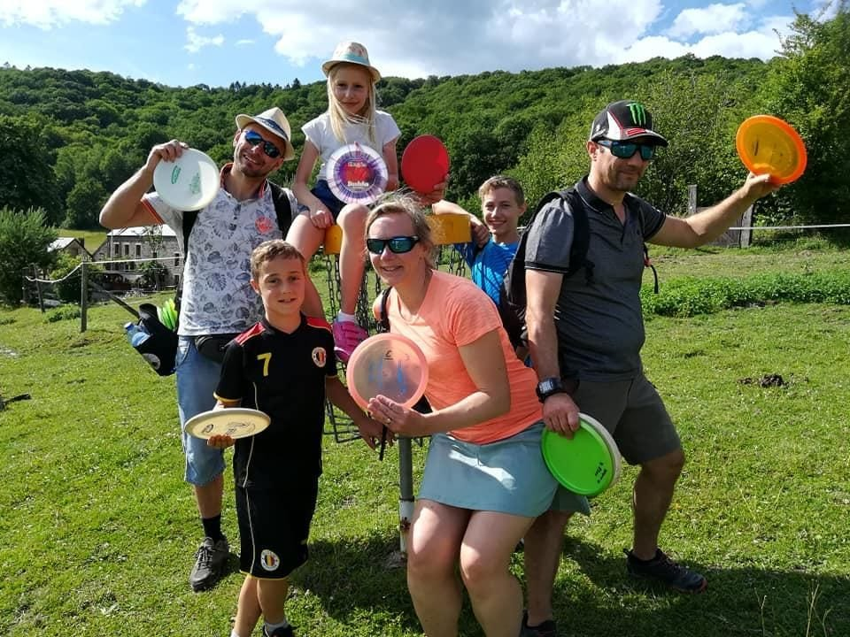
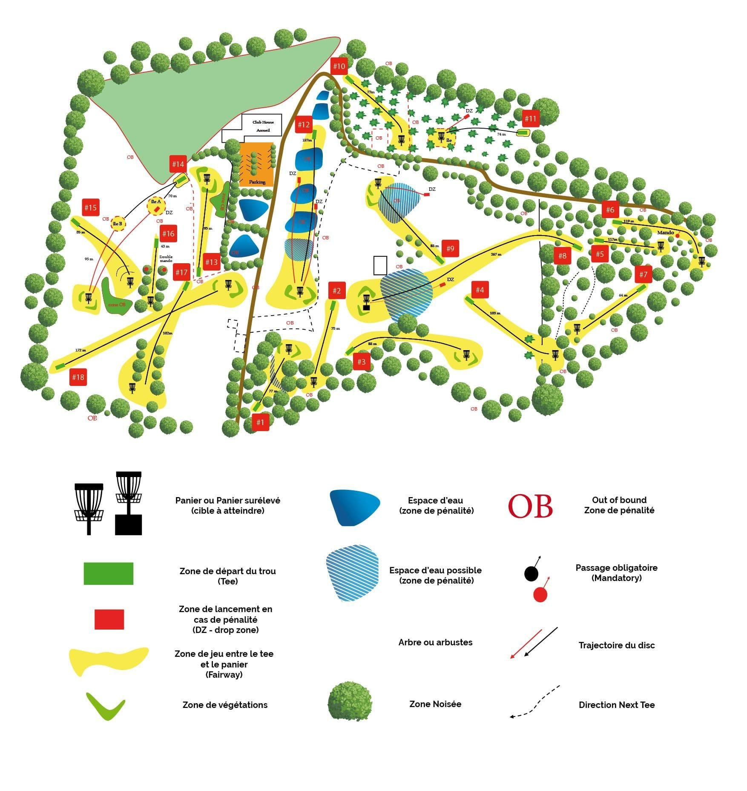

Envie de tester un sport en plein air accessible à tous, mêlant précision, stratégie et nature ? Venez jouer au **disc-golf** aux 4 Sources, à Yvoir, près de Namur !

Nous avons la chance d’accueillir **l’un des plus beaux parcours de disc-golf de Belgique**, géré par le **club** [Disc-Golf Attitude](https://www.discgolfattitude.be). Situé en pleine nature, notre terrain vallonné offre un cadre exceptionnel pour pratiquer ou découvrir ce sport.

## Un parcours exceptionnel

Le parcours se compose de **18 trous**, s’étendant sur **2 kilomètres** avec **13% de dénivelé**, offrant un défi aussi ludique que technique. Que vous soyez débutants ou joueurs confirmés, vous apprécierez la diversité du tracé et la beauté des paysages forestiers environnants.

> **Notre parcours se situe en zone privée** Veuillez prendre contact avec le club Disc-Golf Attitude) avant de vous rendre sur place.

## Initiation et perfectionnement

Vous souhaitez vous initier en groupe au disc-golf ou améliorer votre lancer ? **Des sessions d’initiation sont organisées** par le club **Disc-Golf Attitude**, directement sur le parcours. C’est l’occasion idéale pour apprendre les bases du jeu et maîtriser vos lancers dans une ambiance conviviale.

**Réserve votre initiation dès maintenant** sur le site du club :

[Discgolf Attitude Réservation | Discgolf Attitude](https://www.discgolfattitude.be/reservation)

## Accès et informations pratiques

**Lieu** : Les 4 Sources / Domaine d’Ahinvaux, Yvoir

→ à 20 minutes de Namur → à 15 minutes de Dinant

🗺️ [Accès aux 4 Sources](/a-propos/acces-ahinvaux)

🅿️ **Parking sur place**

🌳 **Cadre naturel exceptionnel dans une clairière entourée de forêts**

Que vous soyez un passionné de disc-golf, un curieux souhaitant découvrir une nouvelle activité ou un groupe d’amis cherchant une sortie originale près de Namur, **notre parcours vous attend !**

N’hésitez pas à combiner votre partie de disc-golf avec [une nuit en gîte ou en bivouac](/sejours/hebergements-yvoir) aux 4 Sources pour une immersion totale en pleine nature.
