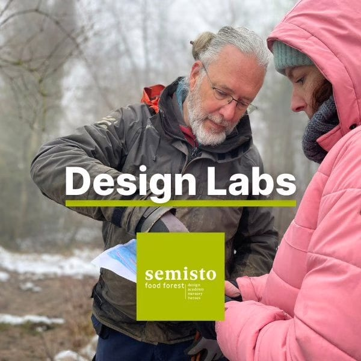
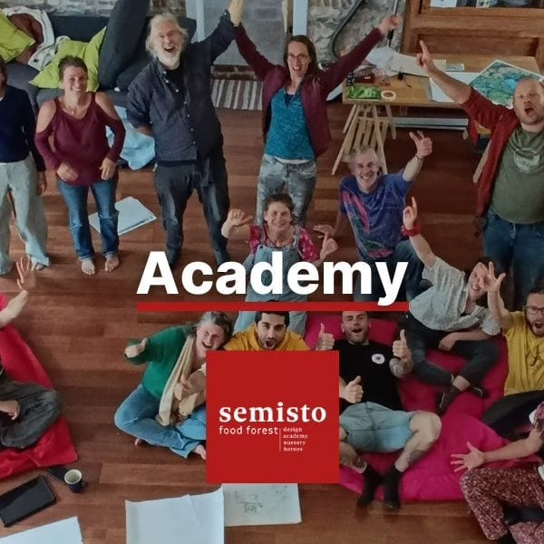
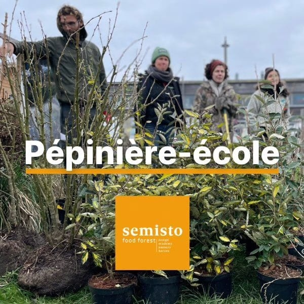
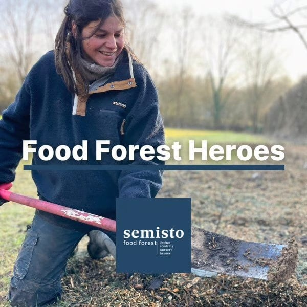

#### **Les 4 Sources sont le QG de Semisto, l’association qui oeuvre à nous faire passer dans l’ère des forêts comestibles. Semisto a été créé par** **[Michael](/collectif/michael-hulet)****, co-fondateur de notre collectif.**

<!-- columns -->
<!-- column width="50%" -->

## [Bureau d’études](https://www.semisto.org/poles/bureau-d-etudes-semisto)

Nous concevons en équipe des **forêts-jardins** **et** **jardins nourriciers** qui respectent votre vision, qui régénèrent la biosphère et vous reconnectent à votre environnement.

<!-- column width="50%" -->

## [Formations](https://www.semisto.org/poles/formations-semisto)

**Apprends à faire naitre ta forêt-jardin** et à l'entretenir jusqu'à ce qu'elle t’apporte ses plus belles récoltes. Ou **apprends un nouveau métier** et deviens concepteur·rice de forêts comestibles !
<!-- /columns -->

<!-- columns -->
<!-- column width="50%" -->

## [Pépinière-école](https://www.semisto.org/poles/pepiniere-ecole-semisto)

Des actions concrètes pour faire émerger et soutenir un **réseau de micro-pépiniéristes** réunis par des valeurs et des convictions.

<!-- column width="50%" -->

## [Food Forest Heroes](https://www.semisto.org/poles/food-forest-heroes)

Des groupes locaux de **planteur·euse·s ultra-MOTIVÉS pour planter l’abondance** en musique et tisser de nouveaux liens enrichissants 🧑‍🎤 🎵 🎻
<!-- /columns -->

<a class="button" href="https://www.semisto.org">Visite le site web de Semisto</a>
